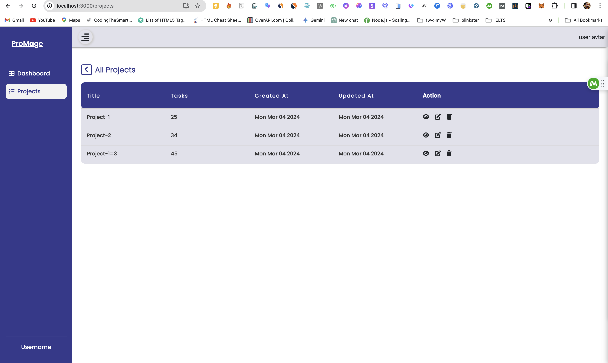

# Mage Frontend

This is the front-end application for Mage, a project management system. It allows users to view, create, edit, and delete projects and tasks. Below are the steps to run the project and an overview of its architecture and design.

## Getting Started

To start the frontend application, follow these steps:

1. Clone the repository:

   ```bash
   git clone https://github.com/saqib-github/Mage-ui.git
   cd Mage-frontend
   ```

2. Install dependencies:

   ```bash
   npm install
   ```

3. Set up environment variables:
   Create a `.env` file in the root directory with the following variables:

   ```
   REACT_APP_API_URL=http://localhost:8080
   ```

4. Start the development server:

   ```bash
   npm start
   ```

   ## Mage Frontend



This is the front-end application for Mage, a project management system. It allows users to view, create, edit, and delete projects and tasks. Below are the steps to run the project and an overview of its architecture and design.

## Architecture and Design

### Technologies Used

The frontend application is built using React.js with TypeScript. React.js was chosen for its component-based architecture, which allows for easy reusability and maintainability of code. TypeScript adds static typing to JavaScript, providing better code quality and developer experience.

### State Management

The application uses Redux for state management. Redux provides a centralized store for managing the application state, making it easier to manage and update the state across different components.

### Styling

Styling is done using CSS modules and Material-UI. CSS modules allow for scoped styling, ensuring that styles do not leak out to other components. Material-UI provides a set of pre-designed components that can be easily customized to fit the design of the application.

### Routing

Routing is handled using React Router. React Router allows for declarative routing in React applications, enabling navigation between different pages/components in the application.

## Running Tests

To run the tests, use the following command:

```bash
npm test
```

## Additional Features

While not required for the coding challenge, additional features could be added to enhance the frontend application, such as:

- Implementing user authentication using JWT for secure access to the application
- Adding form validation to ensure that data entered by users is valid
- Implementing drag-and-drop functionality for reordering tasks within a project

## Conclusion

This README provides a basic overview of the Mage frontend application. For more information and detailed instructions, refer to the documentation and codebase in the repository.
